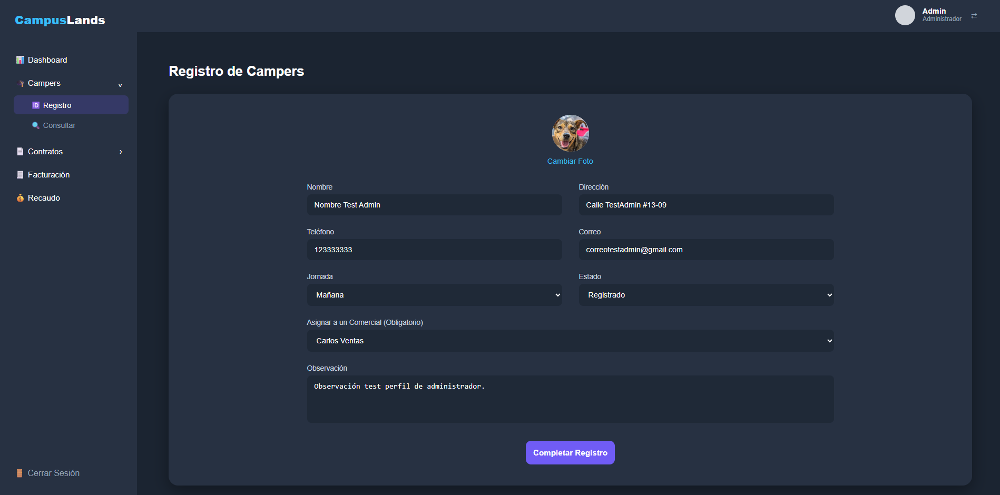
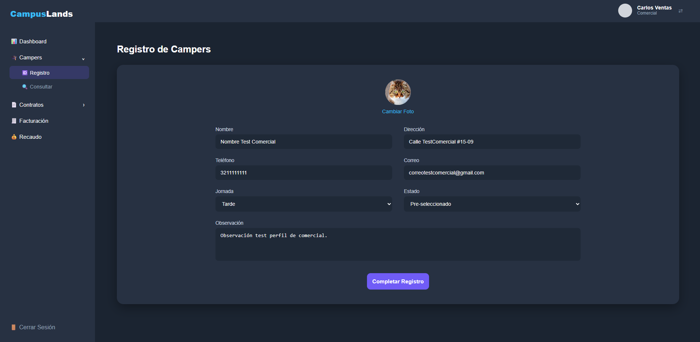
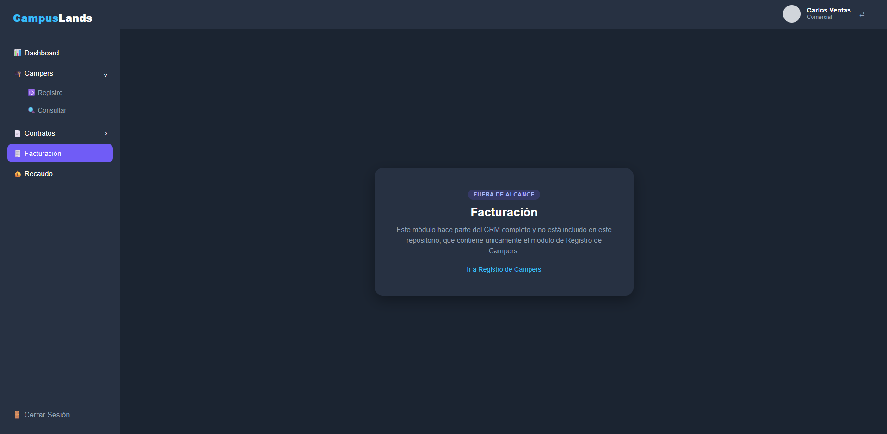

# CRM Camper Registration Module

Camper registration module for a team-built commercial CRM MVP, running standalone with React, TypeScript and JSON Server.

Built as part of a Scrum team of six developing the Campuslands Tools CRM MVP (user story HU-2.1). The full CRM is private and was never deployed to production. This repository contains only my module, with fictional data. The layout, the profile switch in the header and the "out of scope" pages are demo scaffolding so the module can run on its own.

---

## Features

- Registration form: name, address, phone, email, schedule, status, notes and profile photo
- Role-based behavior: Admin and Master must pick the camper's sales rep from a list; Comercial is assigned automatically to themselves
- Required-field validation for the name and, for Admin/Master, the sales rep
- Photo upload resized to fit 400×400 px and stored as base64 JPEG on a white background, so transparent PNGs don't turn black
- Observation history: a note is saved with an id, timestamp and author, only when text is entered
- Profile switch in the header to toggle between Admin and Comercial in the demo

---

## Tech stack

- React 19, TypeScript 5.9 (strict mode) and Vite 7
- React Router 7
- CSS Modules
- JSON Server: local REST API over `data/campers.json`

---

## Setup instructions

Requires Node.js 22.12 or newer (a JSON Server 1.0 requirement).

1. Clone the repo and install dependencies:

```
git clone https://github.com/jorgegmch/crm-registro-campers.git
cd crm-registro-campers
npm install
```

2. Start the API and the app in two terminals:

```
npm run api   # JSON Server on http://localhost:4000
npm run dev   # App on http://localhost:5173
```

Other scripts: `npm run build` (type-check and build), `npm run lint`, `npm run preview`.

---

## Usage

- Open `http://localhost:5173`. The form starts as Admin.
- Fill in the fields, choose a sales rep and press **Completar Registro**.
- Click the profile in the header to switch to Comercial: the sales rep selector disappears and the camper is assigned to Carlos Ventas.
- Registered campers are saved in `data/campers.json` and listed at `http://localhost:4000/campers`. To reset the demo data, run `git restore data/campers.json`.
- The other sidebar entries (Dashboard, Consultar, Contratos, Facturación, Recaudo) belong to other CRM modules and show an "out of scope" notice.

---

## Screenshots

**Admin: the sales rep selector is required**



**Comercial: assigned automatically, no selector**



**Modules outside this repository**



---

## Project structure

```
crm-registro-campers
├── data/
│   ├── campers.json
│   └── comerciales.json
├── docs/
│   ├── admin-view.png
│   ├── comercial-view.png
│   └── out-of-scope.png
├── src/
│   ├── components/
│   │   ├── form/
│   │   │   ├── BotonRegistro.tsx
│   │   │   ├── InputCampo.tsx
│   │   │   ├── SelectorCampo.tsx
│   │   │   └── SubidaFoto.tsx
│   │   └── layout/
│   │       ├── Header.tsx
│   │       ├── MainLayout.tsx
│   │       └── Sidebar.tsx
│   ├── pages/
│   │   ├── FueraDeAlcance.tsx
│   │   └── RegistroCampersPage.tsx
│   ├── styles/
│   │   ├── FueraDeAlcance.module.css
│   │   ├── MainLayout.module.css
│   │   └── RegistroCampers.module.css
│   ├── types/
│   │   └── campers_types.ts
│   ├── App.tsx
│   ├── index.css
│   └── main.tsx
├── .gitattributes
├── .gitignore
├── eslint.config.js
├── index.html
├── package-lock.json
├── package.json
├── README.md
├── tsconfig.app.json
├── tsconfig.json
├── tsconfig.node.json
└── vite.config.ts
```

---

## Limitations

- Data is stored in a JSON file by design: the original MVP had no database. JSON Server rewrites the whole file on every write, so it is not suited to concurrent use.
- Photos are stored as base64 inside that file. Fine for a demo, not for production.
- There is no authentication. Roles are simulated with the header switch; in the full CRM the role came from the login and the sales reps from the users API.
- There are no automated tests.

---

## License

Copyright (c) 2026 Jorge Gomez. All rights reserved.

This repository is published for portfolio review. The code may not be copied, modified or redistributed without permission.

Built by [Jorge Gomez](https://github.com/jorgegmch) for the Campuslands Tools CRM.